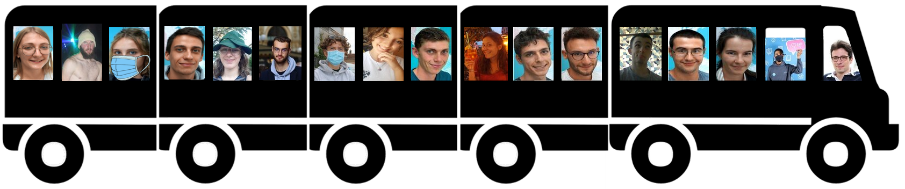
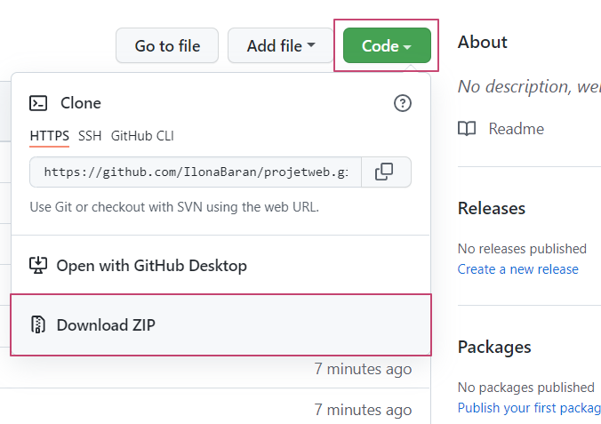
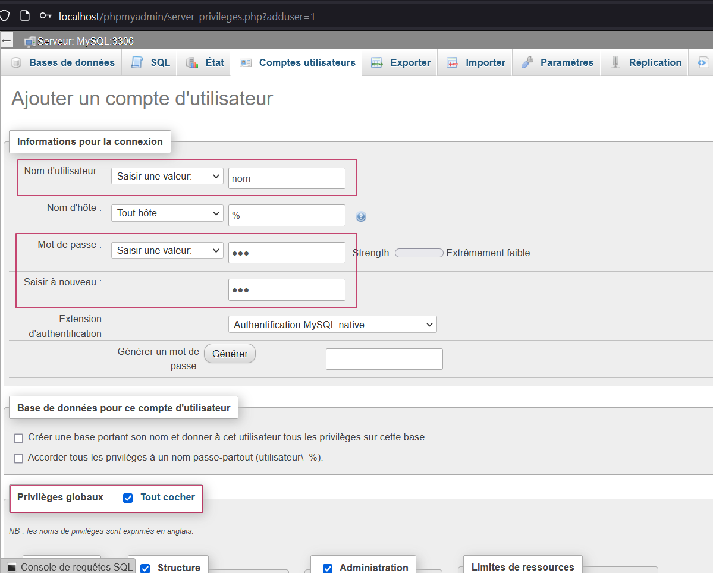
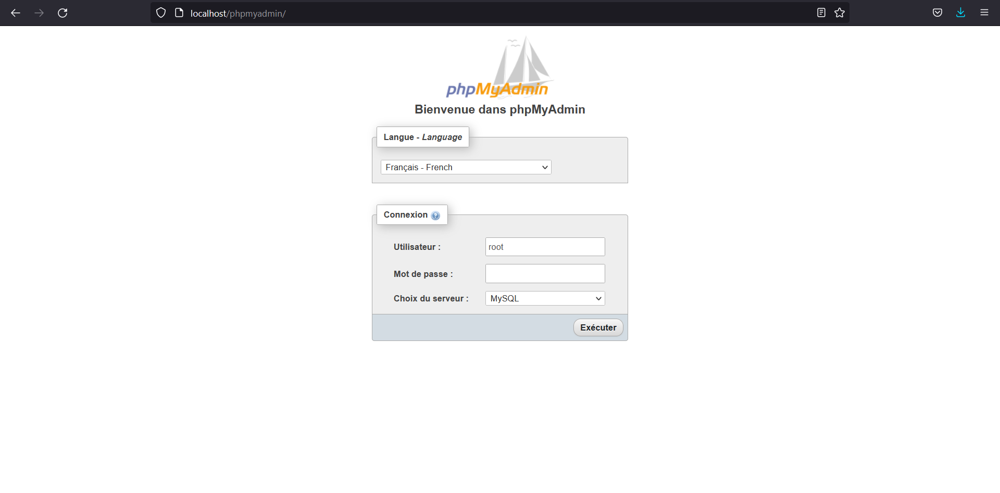

Projet WEB « Escape game » géographique 
=======
## Table of Contents
1. [Informations générales](#Informations générales)
2. [Pré-requis](#Pré-requis)
3. [MAMP](#MAMP)
4. [WAMP](#WAMP)
5. [Source](####Sources)

#### Département Informatique de l'ENSG - Géomatique
#### Programmation WEB avancée

# Informations générales
#### Auteurs
Ilona Baran et Maeve Blarel
#### Date
1/11/2021 au 28/11/2021 (4 semaines)
#### URL du site
http://localhost/projetweb/pagePrincipale.php
#### Le Projet et ses objectifs:
L’objectif de ce TP est de créer un « escape game », notamment en résolvant des énigmes et en trouvant 
des objets. Le tout, sur une carte web.
Nous avons réalisé un « escape game » qui s'intitule: Tour de promo.
## Langages utilisés
+ HTML5, CSS3
+ JavaScript, AJAX
+ PHP, MySQL
## Responsive ?
Oui, il est responsive! (commentaire ilo : HEUUUUUU) (commentaire maeve : ON VA LE RENDRE RESPONSIVE)

***

# Pré-requis
+ Installation de MAMP ou de WAMP  
+ Connection internet pour l'affichage de la carte  
+ Utilisation d'un navigateur (évitez Microsoft Edge et Internet explorer)

# MAMP

#### Récupération du projet #
Aller sur https://github.com/IlonaBaran/projetweb.git et télécharger le ZIP du projet 

   
// après je ne sais pas ou il faut le placer :((

### Import de la base de données #
Ouvrir Mamp. 
Aller dans MAMP/Préférences/Web server et vérifier que le "document root" est bien l'emplcament où se trouve le projet récupéré. Dans le cas contraire, veuillez déplacer le projet dans le dossier explicité par le document root ou changer le document root (cela risque d'être plus compliqué).
Aller sur http://localhost/phpmyadmin.
Créer une base de données « escape game ».
Importer le fichier espacegame.sql à cet emplacement.  
Ouvrir dans un éditeur de texte le fichier connexion.php, et modifier, au besoin, de telle façon à avoir ce qui suit : $link = mysqli_connect('localhost','nom','nom', 'escapegame'); 
Pensez à remplacer nom par votre prénom. // EST ce que c'est utile de dire ca ?    
  

Creer un compte d'utilisateur dans http://localhost/phpmyadmin en suivant les instructions suivantes:

puis "éxécuter" en bas de la page.
Bravo, vous allez bientôt pouvoir commencer à jouer !

# WAMP 

#### Récupération du projet #
Aller sur https://github.com/IlonaBaran/projetweb.git et télécharger le ZIP du projet 

Extraire le projet et le mettre dans .../wamp64/www

### Import de la base de données #
Ouvrir WAMP. 
Aller dans MAMP/Préférences/Web server et vérifier que le "document root" est bien l'emplcament où se trouve le projet récupéré. Dans le cas contraire, veuillez déplacer le projet dans le dossier explicité par le document root ou changer le document root (cela risque d'être plus compliqué).

Aller sur http://localhost/phpmyadmin.
Connecter vous sans changer l'identifiant et le mot de passe pré-rentré. Normalement, vous devriez avoir :

Créer une base de données « escape game ».
Importer le fichier espacegame.sql à cet emplacement.  
Ouvrir dans un éditeur de texte le fichier connexion.php, et modifier, au besoin, de telle façon à avoir ce qui suit : $link = mysqli_connect('localhost','root','', 'escapegame'); 

Bravo, vous allez bientôt pouvoir commencer à jouer !

## Consigne et déroulement du jeu
Le jeu comporte 3 pages :   
- une page principale.   
Vous devrez rentrer un pseudo pour pouvoir commencer à jouer. Celui-ci doit faire entre 1 et 20 caractères.   

- une page de jeu   
Pour pouvoir jouer au jeu, vous devez :   

+ Lorsque vous voyez le bouton "Suivant", vous devez cliquer dessus   
+ Vous devez validez la saisie d'un champ texte en appuyant sur la touche entrée

- une page de fin   
Vous pourrez voir le temps que vous avez mis à réaliser le jeu ainsi que votre position par rapport aux autres joueurs.  
Le retour à la page principale est permis grâce à un bouton. 

## Screenshots 

### Cahier de bord : Organisation au jour le jour

### Difficultés et solutions techniques rencontrées

#### Sources
La fonction strNoAccent de la page carte.js
